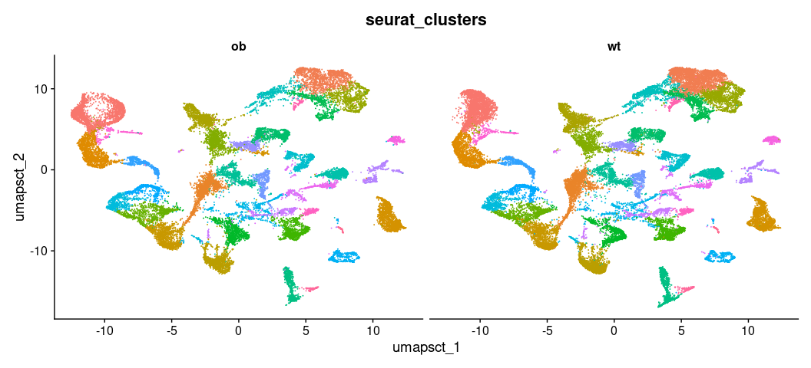
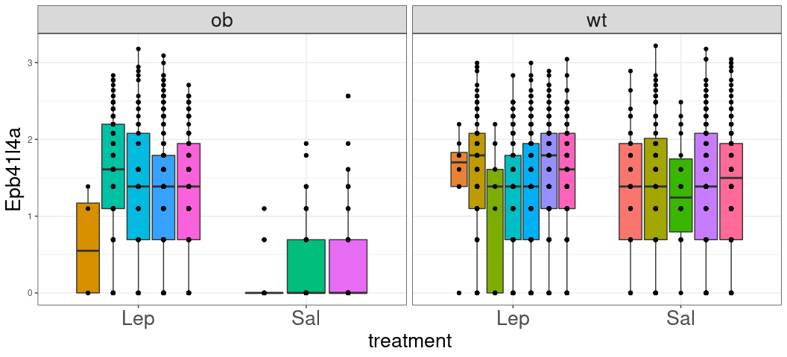

Detect DEGs in snRNAseq data
================
Bitao Qiu
10/06/2022

``` r
library(Seurat)
library(tidyverse)
source('R/detect_DEGs.R')
```

Load Seurat object, expression data should have been properly
normalized:

``` r
load('data/test_object.Rdata')
```

Detect cell clusters and visualize the cell clusters:

``` r
# test_data <- FindNeighbors(test_data, dims = 1:50)
# test_data <- FindClusters(test_data, resolution = 0.8)
DimPlot(test_data, group.by = c('treatment'), split.by = 'geno') & NoLegend()
```

<!-- -->

``` r
DimPlot(test_data, group.by = c('seurat_clusters'), split.by = 'geno') & NoLegend()
```

<!-- -->

We choose and subset cell population “Agrp” to perform differential
expression analysis:

``` r
selected_cells = which(test_data$labels %in% 'Agrp' & test_data$time == '3')
test_data.sub = subset(test_data, cells = selected_cells)
test_data.sub_exp = data.frame(t(as.matrix(test_data.sub@assays$SCT@data)), test_data.sub@meta.data)
```

An example for running glm for a single gene:

``` r
# A typical GLM:
run_glm(test_data.sub_exp$Stat3, test_data.sub@meta.data, model = '(exp) ~ ((treatment*geno))', mixed_model = F)
```

    ##                      Estimate Std. Error    t value     Pr(>|t|)
    ## (Intercept)          1.827511 0.02562367  71.321224 0.000000e+00
    ## treatmentSal        -1.043511 0.05273518 -19.787751 2.051453e-79
    ## genowt              -0.223818 0.03496645  -6.400937 1.938736e-10
    ## treatmentSal:genowt  1.043919 0.06369129  16.390289 1.377727e-56

``` r
# A mixed-effect model(GLMR):
run_glm(test_data.sub_exp$Stat3, test_data.sub@meta.data, model = '(exp) ~ treatment*geno + (1|hash_id)', mixed_model = T)
```

    ##                       Estimate Std. Error   t value
    ## (Intercept)          1.8543742 0.06249055 29.674472
    ## treatmentSal        -1.0145704 0.10565527 -9.602648
    ## genowt              -0.2326743 0.08227157 -2.828125
    ## treatmentSal:genowt  0.9885959 0.13315733  7.424270

Detect DEGs with a mixed-effect model in subset cells:

``` r
# Typical GLM (For comparison):
agrp_deg.glm = snRNA_DEGs(test_data.sub, fixed_effects = 'treatment*geno', mixed_model = F, deg_type = 'abs', n_cores = 50)

# GLMR:
agrp_deg.glmr = snRNA_DEGs(test_data.sub, fixed_effects = 'treatment*geno',random_effect = '(1|hash_id)', deg_type = 'abs', n_cores = 50)
```

Visualization by plotting the top candidate gene:

``` r
head(agrp_deg.glm[order(agrp_deg.glm$treatmentSal.genowt, decreasing = T),])
```

    ##         X.Intercept. treatmentSal     genowt treatmentSal.genowt
    ## Stat3       71.32122    -19.78775  -6.400937            16.39029
    ## Adam12      55.59981    -21.28639 -10.500369            14.22258
    ## Rps6ka5     64.97881    -18.41219   2.976630            13.08382
    ## Tcf4        96.65507    -16.43320  -8.423919            12.65950
    ## Zdhhc14    142.23611    -18.72888  -7.951558            12.43248
    ## Grin2a      80.28792    -17.42760  -7.699558            12.13228

``` r
head(agrp_deg.glmr[order(agrp_deg.glmr$treatmentSal.genowt, decreasing = T),])
```

    ##          X.Intercept. treatmentSal    genowt treatmentSal.genowt
    ## Ptprg        44.64992   -14.465604 -3.903114            9.557532
    ## Epb41l4a     25.18170   -10.674946  0.871059            8.216012
    ## Rgs2         25.45224    -9.784801 -7.956802            7.692028
    ## Stat3        29.67447    -9.602648 -2.828125            7.424270
    ## Sgcz         65.42480    -9.895412  4.277937            7.322433
    ## Rps6ka5      29.90914   -10.238084  1.265736            7.139696

``` r
ggplot(test_data.sub_exp,aes(y = Epb41l4a, x = treatment, fill = hash_id)) +
  geom_boxplot()+
  facet_wrap(~geno)+
  geom_jitter(position=position_dodge(0.75))+
  theme_bw()+
  theme(legend.position = 'none', 
        axis.text.x = element_text(size = 20), 
        strip.text.x = element_text(size = 20),
        axis.title = element_text(size = 20))
```

<!-- -->

Also by plotting the target gene’s expression pattern in a UMAP:

``` r
FeaturePlot(test_data, features = 'Epb41l4a', split.by = 'geno') & NoLegend()
```

<!-- -->
