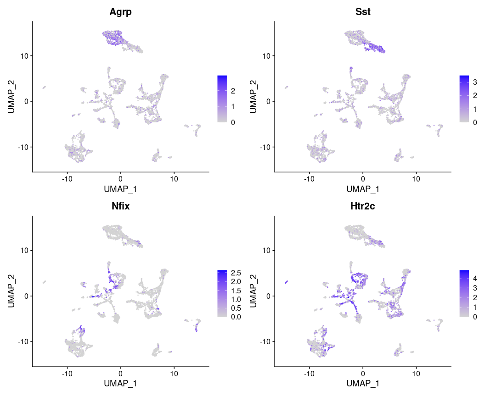

Cell type annotation with marker genes
================
Bitao Qiu
17/06/2022

This pipeline is most useful when a reference snRNAseq dataset is not
available and you have some marker genes for your target cell types of
interest.

If you have a good reference snRNAseq dataset, using Seurat anchor
transfer (reference based) might be better.

``` r
source('R/find_markers.R')
source('R/sctype_scoring.R')
source('R/annotate_cells.R')
library(future)
library(styler)
library(Matrix)
library(Seurat)
library(tidyverse)
```

Load query data, reference data, and marker gene database:

``` r
# Load query data
load('data/test.data.B10_ref.based.Rdata') 
# Load reference RNAseq data
hypo.ref <- readRDS('data/ref.cam.hypo.rds') 
# Load markers (an hierarchy marker database), extracted by extract_marker.R
# One can also extract markers with Seurat (extract_marker_seurat.R) and rank them by fold-changes.
load('data/marker_db_cam_hypo.Rdata')
```

## Level 1 annotation

Construct marker gene list:

``` r
# Users can also provide their own marker gene list: list(cell_type: markers)
# Select the top n DEGs (target cells vs. background) from each cell type as marker genes. 
# For high level annotation, n within 100 and 200, for low level annotation, n = 30 - 50 should be fine.
top_n = 200
marker_gene_lv1 = contruct_marker_list(marker_db_cam_hypo$lv1, top_n = top_n)

# Example of a marker gene list:
lapply(marker_gene_lv1, head, 5)
```

    ## $Astrocyte
    ## [1] "Slc4a4"  "Slc1a2"  "Slc1a3"  "Sparcl1" "Agt"    
    ## 
    ## $Endothelial_cell
    ## [1] "Itm2a"   "Bsg"     "Abcb1a"  "Slco1a4" "Flt1"   
    ## 
    ## $Ependymal_cell
    ## [1] "Tmem212" "Ccdc153" "Dbi"     "Rarres2" "Dynlrb2"
    ## 
    ## $Fibroblast
    ## [1] "Col1a2"   "Dcn"      "Apod"     "Itih5"    "Crispld2"
    ## 
    ## $Mural_cell
    ## [1] "Cald1"  "Rgs5"   "Crip1"  "Igfbp7" "Tm4sf1"
    ## 
    ## $Neuron
    ## [1] "Ahi1"   "Nap1l5" "Ttc3"   "Rtn1"   "Snhg11"
    ## 
    ## $Oligodendrocyte
    ## [1] "Olig1"   "Pllp"    "Syt11"   "Enpp2"   "Septin7"
    ## 
    ## $Pars_tuberalis
    ## [1] "Ces1d" "Cga"   "Epcam" "Chga"  "Emb"  
    ## 
    ## $Perivascular_macrophages_and_microglia
    ## [1] "C1qb" "Ctss" "C1qc" "C1qa" "Hexb"
    ## 
    ## $Tanycyte
    ## [1] "6330403K07Rik" "Prdx6"         "Nnat"          "Col23a1"      
    ## [5] "Ntrk2"

Annotation:

``` r
test.data.B10.lv1 = test.data.B10
n_pc = 20
# Define cell clusters,  will be used for cluster level annotation:
test.data.B10.lv1 <- FindNeighbors(test.data.B10.lv1, dims = 1:n_pc, verbose = F)
test.data.B10.lv1 <- FindClusters(test.data.B10.lv1, resolution = 1) 
```

    ## Modularity Optimizer version 1.3.0 by Ludo Waltman and Nees Jan van Eck
    ## 
    ## Number of nodes: 7684
    ## Number of edges: 250070
    ## 
    ## Running Louvain algorithm...
    ## Maximum modularity in 10 random starts: 0.9260
    ## Number of communities: 31
    ## Elapsed time: 0 seconds

``` r
test.data.B10.lv1 <- cell_annotation_ref_based(test.data.B10.lv1, marker_gene_lv1, label = 'sctype_label.lv1', data_slot = 'scale.data', filter = T)

# Visualization:
# sctype_label.lv1.filtered are cell level annotations (cells with low scores are marked as "Unknown"); 
# sctype_label.lv1.filtered.cluster are cluster level annotations.
DimPlot(test.data.B10.lv1, group.by = c('sctype_label.lv1.filtered','sctype_label.lv1.filtered.cluster'),label = T) & NoLegend()
```

<!-- -->

## Level 2 annotation

We use neuron cells as an example.

Construct marker gene list (for neuron cell types):

``` r
# In contrast to level 1 annotation, we only select top 50 genes (sorted by W score) as marker genes, because the transcriptomics difference among (sub-)cell types might be small at level 2.
top_n = 50
marker_gene_lv2.neuron = contruct_marker_list(marker_db_cam_hypo$lv2$Neuron, top_n = top_n)
```

Annotation:

``` r
# For sub cell-type annotation, we choose 50 PCs and a high resolution for cluster annotation.
n_pc = 50
resolution = 1

# Subset neuron cells scRNAseq data:
neurone_cells = colnames(test.data.B10.lv1)[which(test.data.B10.lv1$sctype_label.lv1.filtered.cluster %in% c('Neuron'))]
test.data.B10.neuron = subset(test.data.B10.lv1, cells = neurone_cells)
test.data.B10.neuron = FindVariableFeatures(test.data.B10.neuron)
test.data.B10.neuron <- FindNeighbors(test.data.B10.neuron, dims = 1:n_pc, verbose = T)
test.data.B10.neuron <- FindClusters(test.data.B10.neuron, resolution = resolution) 
```

    ## Modularity Optimizer version 1.3.0 by Ludo Waltman and Nees Jan van Eck
    ## 
    ## Number of nodes: 5385
    ## Number of edges: 165749
    ## 
    ## Running Louvain algorithm...
    ## Maximum modularity in 10 random starts: 0.9165
    ## Number of communities: 34
    ## Elapsed time: 0 seconds

``` r
test.data.B10.neuron =  cell_annotation_ref_based(test.data.B10.neuron, marker_gene_lv2.neuron, label = 'sctype_label.lv2')

# Visualization (lvl.2):
# sctype_label.lv2.filtered.cluster are cluster level annotations, depended on cluster annotation (seurat_clusters).
test.data.B10.neuron = RunPCA(test.data.B10.neuron)
test.data.B10.neuron = RunUMAP(test.data.B10.neuron, dims = c(1:n_pc))

DimPlot(test.data.B10.neuron, group.by = c('sctype_label.lv2.filtered.cluster', 'seurat_clusters'),label = T) & NoLegend()
```

<!-- -->

## Compare with Seurat annotation

### Level 1 annotation:

``` r
# Find anchors:
hypo.ref.anchors <- FindTransferAnchors(reference = hypo.ref, query = test.data.B10.lv1, recompute.residuals = F,
                                               dims = 1:n_pc, reference.reduction = "pca")

# Seurat cell level annotation:
predictions.hypo <- TransferData(anchorset = hypo.ref.anchors, refdata = hypo.ref$taxonomy_lvl2, dims = 1:n_pc)
test.data.B10.lv1 <- AddMetaData(test.data.B10.lv1, metadata = predictions.hypo)

# Seurat cluster level annotation.
test.data.B10.lv1 = cluster_level_annotation(test.data.B10.lv1, sctype_label = 'predicted.id')

# Direct comparison between marker gene based and anchor transfer method:
# Left: Marker gene annotation; Right: Seurat annotation
DimPlot(test.data.B10.lv1, group.by = c('sctype_label.lv1.filtered.cluster','predicted.id.cluster'),label = T) & NoLegend()
```

<!-- -->

### Level 2 annotation:

``` r
# Subset neuron cells from reference and and find anchors:
hypo.ref.neuron = subset(hypo.ref, subset = `taxonomy_lvl2` == 'Neuron')
hypo.ref.neuron = RunPCA(hypo.ref.neuron)
hypo.ref.neuron = RunUMAP(hypo.ref.neuron, dims = c(1:n_pc))
hypo.ref.neuron.anchors <- FindTransferAnchors(reference = hypo.ref.neuron, query = test.data.B10.neuron, recompute.residuals = F,
                                               dims = 1:n_pc, reference.reduction = "pca")

# Seurat cell level annotation:
predictions.neuron <- TransferData(anchorset = hypo.ref.neuron.anchors, refdata = hypo.ref.neuron$cell_type_all_lvl2, dims = 1:n_pc)
test.data.B10.neuron <- AddMetaData(test.data.B10.neuron, metadata = predictions.neuron)

# Seurat cluster level annotation.
test.data.B10.neuron = cluster_level_annotation(test.data.B10.neuron, sctype_label = 'predicted.id')

# Direct comparison between marker gene based and anchor transfer method:
# Left: Marker gene annotation; Right: Seurat annotation
DimPlot(test.data.B10.neuron, group.by = c('sctype_label.lv2.filtered.cluster', 'predicted.id.cluster'),label = T) & NoLegend()
```

<!-- -->

``` r
# Plotting candidate genes:
FeaturePlot(test.data.B10.neuron, features = c('Agrp','Sst','Nfix','Htr2c'))
```

<!-- -->

**Marker-gene based** and **Reference based (anchor transfer)** give a
similar result, the former is dependent on *the quality of marker
genes*, whereas the latter is dependent on *the quality of reference
snRNAeq data*.

### Note:

1.  The choice of scale (*scale.data*) or not (*data*) in
    *cell\_annotation\_ref\_based* can be important. If (1) there are
    lots of diversity among neurons (different regions) in your data set
    and (2) your markers are extracted from a single brain region (e.g.,
    the arcuate–median eminence complex (Arc-ME)), scaling the data will
    introduce negative values for some of the neuron marker genes
    outside of the Arc-ME. If you expect your sncRNA data has a similar
    composition as the reference data set, using scale-data should be
    better because it will take between-cell-type variation into
    consideration (see (Note 2)).

2.  The choice of marker genes can also be important: Some of the neuron
    marker genes can have a higher expression level in Ependymal cells
    than Ependymal cell marker genes. If we only choose 10 genes, these
    Ependymal cells will be annotated as neurons.

3.  In the future, we should also take the within-cell-type expression
    ranking into consideration (if within-cell gene expression levels
    are comparable). That will be exp<sub>neuron\_marker,neurons</sub>:
    exp<sub>background\_genes, neurons</sub> &gt;&gt;
    exp<sub>neuron\_marker,other\_cells</sub>:
    exp<sub>background\_genes, other\_cells</sub>.
